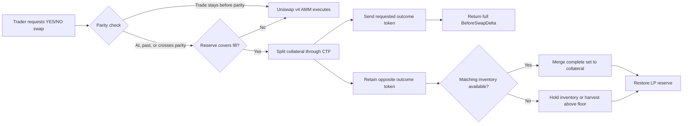

# Complete-Set Internalization Hook

> A Uniswap v4 hook that turns the binary prediction-market invariant `1 YES + 1 NO = 1 unit of collateral` into executable liquidity and a price-impact backstop.

Built for the Atrium Uniswap Hook Incubator Hookathon, Sustainable Liquidity & MEV Protection track.

[**Inspect the live hook**](https://sepolia.uniscan.xyz/address/0xc88B0aC546a99B586199dDBeE30D801Ee1d80088) · [**Verify the deployment transaction**](https://sepolia.uniscan.xyz/tx/0x1a9052149599281a934f1df96205a5d3ed9eb10aec14b2a135a83d5b71130623) · [**Run the judge walkthrough**](#judge-walkthrough)

## The 30-second version

A binary prediction market mints YES and NO in complete sets. One collateral token always splits into one YES and one NO, and those two tokens always merge back into one collateral token.

A normal automated market maker (AMM) does not enforce that relationship during a YES/NO swap. A large trade can therefore cross parity and receive a worse execution price even though the Conditional Tokens Framework (CTF) can create the required inventory at exactly 1:1.

This hook compares the requested trade with that structural price. When the pool is at parity, past parity, or the trade would cross parity, the hook:

1. Splits collateral from its liquidity-provider reserve into YES and NO
2. Gives the trader the requested outcome token at 1:1
3. Retains the opposite token for a later matching trade or merge
4. Returns a `BeforeSwapDelta` that fully accounts for the trade without moving the AMM curve

If the reserve cannot cover the trade, the hook leaves execution to the normal Uniswap v4 pool.

## Why this matters

Prediction markets have a source of liquidity that ordinary AMMs cannot see: complete-set convertibility.

Without this hook, the pool relies only on deposited YES/NO inventory. Thin liquidity increases price impact and exposes traders to execution beyond the market's structural parity point. With the hook, collateral reserves become outcome-token liquidity exactly when the AMM would quote a worse result.

The mechanism improves sustainable liquidity without fabricating yield:

- **Traders**: receive a hard 1:1 backstop when the complete-set route applies
- **Liquidity providers**: fund a share-based collateral reserve recoverable through complete-set merges
- **The AMM**: handles trades normally when its curve offers the appropriate route
- **Prediction markets**: gain liquidity from their settlement primitive instead of relying only on paired token deposits

## Core insight

The hook treats complete-set conversion as a second execution venue inside the Uniswap v4 swap lifecycle.

```text
Normal YES/NO pool

Trader swap -> Uniswap curve -> price impact grows with trade size

Hooked YES/NO pool

                         +-> Uniswap curve, when it remains the valid route
Trader swap -> compare --|
                         +-> CTF split at 1:1, when parity is reached or crossed
```

This is not an oracle-based peg and it does not overwrite the pool price. The hook projects the requested trade against active tick liquidity and selects the complete-set route only when the trade reaches the structural parity boundary.

## What makes the hook different

The project combines four properties that are usually implemented separately:

- **Trade-impact-aware routing**: checks where the requested trade would move the pool, not only its current spot price
- **Return-delta execution**: accounts for the complete trade through `beforeSwapReturnDelta`, leaving the PoolManager's AMM delta at zero
- **Recoverable reserve accounting**: collateral deposits mint proportional shares, while matched YES/NO inventory merges back into collateral
- **No-loss surplus harvesting**: idle outcome inventory can trade against the pool and merge only when an on-chain minimum-output floor protects reserve capital

The hook uses only `beforeSwap` and `beforeSwapReturnDelta`. It does not add dynamic fees, an oracle, an off-chain keeper, or an upgradeable proxy.

## System flow



### Swap decision

The complete-set path runs in [`_beforeSwap`](src/CompleteSetInternalizationHook.sol#L184):

1. Reject unregistered or frozen markets
2. Normalize exact-input and exact-output amounts
3. Project the trade against the pool's active tick liquidity
4. Continue through the AMM if the trade does not reach parity
5. Continue through the AMM if the collateral reserve cannot cover the fill
6. Otherwise split collateral, settle the trader at 1:1, retain the opposite leg, and absorb the swap through return delta

### Reserve lifecycle

Liquidity providers deposit collateral through [`depositCollateral`](src/CompleteSetInternalizationHook.sol#L145) and receive proportional reserve shares. They withdraw through [`withdrawCollateral`](src/CompleteSetInternalizationHook.sol#L161).

As opposite trade flow accumulates matching YES and NO inventory, [`mergeIfPossible`](src/libraries/CompleteSetLib.sol#L287) converts complete sets back into collateral. Any recorded surplus must come from collateral actually recovered by that merge.

### Opportunistic surplus

Asymmetric order flow can leave idle YES or NO inventory. [`harvestOpportunisticSurplus`](src/CompleteSetInternalizationHook.sol#L249) sells only the unmatched portion against the pool, then merges the acquired opposite leg.

The caller supplies `minAmountOut`, and the hook enforces an additional break-even floor. An unprofitable harvest reverts instead of reducing reserve capital.

## Verification at a glance

Every headline claim has a reproducible check:

| Evidence | Current result | How to verify |
|---|---:|---|
| Offline Foundry suite | 40 tests passing | `forge test --offline --no-match-path "test/fork/**"` |
| Live Gnosis fork suite | 4 integration tests | `forge test --match-contract CompleteSetInternalizationHookForkTest` |
| Total test count | 44 tests | Review [`test/`](test) |
| Hook permission surface | 2 flags | Run `test_getHookPermissions_onlyBeforeSwapAndReturnDelta` |
| Unichain Sepolia deployment | Live | Inspect the [hook contract](https://sepolia.uniscan.xyz/address/0xc88B0aC546a99B586199dDBeE30D801Ee1d80088) |
| Deployment execution | Successful broadcast | Inspect the [deployment transaction](https://sepolia.uniscan.xyz/tx/0x1a9052149599281a934f1df96205a5d3ed9eb10aec14b2a135a83d5b71130623) |
| Frontend configuration | Chain `1301` | Review [`frontend/public/deployment.json`](frontend/public/deployment.json) |

The offline suite was re-run on September 2, 2026: 40 passed, 0 failed, 0 skipped. The four fork cases require a Gnosis archive-capable RPC endpoint.

## Judge walkthrough

This path demonstrates the mechanism in about five minutes.

### 1. Inspect the live deployment

Open the [hook on Uniscan](https://sepolia.uniscan.xyz/address/0xc88B0aC546a99B586199dDBeE30D801Ee1d80088), then confirm the deployed bytecode and successful creation transaction.

### 2. Run the mechanism tests

```bash
git clone --recurse-submodules https://github.com/JamesVictor-O/Complete-Set-Internalization-Hook.git
cd Complete-Set-Internalization-Hook
forge test --offline --no-match-path "test/fork/**"
```

The most important paired cases are:

- `test_swap_projectedToCrossParity_fillsFullyFromCompleteSet`
- `test_swap_notProjectedToCrossParity_staysOnAmmCurve`
- `test_swap_atParity_fillsFromCompleteSetWithZeroPoolManagerDelta`
- `test_harvestOpportunisticSurplus_revertsOnUnprofitableSlippageFloor`
- `test_symmetricRoundTrip_autoMergesBackToStartingReserveWithZeroSurplus`

### 3. Run the frontend against Unichain Sepolia

```bash
cd frontend
pnpm install
pnpm dev
```

Open the printed local URL. The frontend reads the checked-in deployment, targets Unichain Sepolia by default, and requests an automatic wallet switch to chain `1301`.

The quote panel compares normal AMM execution with complete-set execution before a transaction is submitted.

### 4. Verify the real Gnosis interfaces

Set a Gnosis RPC endpoint and run:

```bash
forge test --match-contract CompleteSetInternalizationHookForkTest -vv
```

These tests execute against the deployed Gnosis Conditional Tokens and legacy Wrapped1155Factory bytecode. They cover split, merge, redemption, and wrapper round trips.

## Live deployment on Unichain Sepolia

The demo deployment uses the canonical Uniswap v4 PoolManager on chain `1301`. It includes the hook, quoter, demo collateral, demo Conditional Tokens contracts, wrapped YES/NO tokens, a registered pool, 1,000 dUSD of hook reserve, and seeded AMM liquidity.

| Contract | Address |
|---|---|
| CompleteSetInternalizationHook | [`0xc88B...0088`](https://sepolia.uniscan.xyz/address/0xc88B0aC546a99B586199dDBeE30D801Ee1d80088) |
| CompleteSetQuoter | [`0xd4B7...eE1B`](https://sepolia.uniscan.xyz/address/0xd4B7fCecE89ABE7cAEd26aB34b548465ae05eE1B) |
| Demo collateral, dUSD | [`0x0115...Fa31`](https://sepolia.uniscan.xyz/address/0x0115CA8539906db2d9a4beE36C64eA94a0d7Fa31) |
| YES wrapper | [`0xfF66...F339`](https://sepolia.uniscan.xyz/address/0xfF6687aB57eF24a4150f0A17755Ca24436B1F339) |
| NO wrapper | [`0x7544...21f5`](https://sepolia.uniscan.xyz/address/0x75445557CF3498CE5062F2A7BDE70161cDBE21f5) |
| Canonical v4 PoolManager | [`0x00B0...62AC`](https://sepolia.uniscan.xyz/address/0x00B036B58a818B1BC34d502D3fE730Db729e62AC) |

Pool ID: `0x8b82518d80bc964538ec4866ef5d91ca13e2df7d2a9885d8adf32ac715650218`

Deployment transaction: [`0x1a905214...71130623`](https://sepolia.uniscan.xyz/tx/0x1a9052149599281a934f1df96205a5d3ed9eb10aec14b2a135a83d5b71130623)

The testnet deployment uses demo CTF and Wrapped1155Factory contracts. Compatibility with the legacy production Gnosis contracts is demonstrated separately by the fork suite.

## Uniswap and ecosystem integrations

Each integration has a specific role and a corresponding implementation surface:

| Integration | Role | Evidence |
|---|---|---|
| Uniswap v4 | Swap lifecycle, flash accounting, return-delta execution, canonical PoolManager | [`CompleteSetInternalizationHook.sol`](src/CompleteSetInternalizationHook.sol) and the [live PoolManager](https://sepolia.uniscan.xyz/address/0x00B036B58a818B1BC34d502D3fE730Db729e62AC) |
| Unichain Sepolia | Live hook, pool, quoter, tokens, and frontend read target | [`frontend/public/deployment.json`](frontend/public/deployment.json) and [deployment records](broadcast/00_DeployCompleteSetInternalizationHook.s.sol/1301/run-latest.json) |
| Gnosis Conditional Tokens Framework | Complete-set split, merge, redemption, and position ID rules | [`IConditionalTokens.sol`](src/interfaces/IConditionalTokens.sol), [`CompleteSetLib.sol`](src/libraries/CompleteSetLib.sol), and the [fork suite](test/fork/CompleteSetInternalizationHookFork.t.sol) |
| Gnosis Wrapped1155Factory | ERC-1155 outcome positions represented as ERC-20 pool currencies | [`IWrapped1155Factory.sol`](src/interfaces/IWrapped1155Factory.sol) and the live wrap/unwrap fork test |
| Permit2 and Hookmate router | Testnet approvals and executable swap path | [`00_DeployCompleteSetInternalizationHook.s.sol`](script/00_DeployCompleteSetInternalizationHook.s.sol) |

The project targets the Uniswap Foundation's Sustainable Liquidity theme directly. It does not claim a separate sponsor integration that is not present in the code.

## Security properties and invariants

The design limits trusted inputs and makes reserve loss explicit:

- **Minimal hook permissions**: only `beforeSwap` and `beforeSwapReturnDelta` are enabled
- **No oracle dependency**: parity comes from the complete-set invariant and pool state
- **No upgradeable proxy**: deployed logic cannot change through an admin upgrade
- **No off-chain keeper requirement**: swaps and merges execute through on-chain calls
- **Reserve-limited fills**: an uncovered trade falls back to the AMM instead of creating a liability
- **Zero PoolManager delta on internalization**: the CTF path fully accounts for the swap
- **Merge-backed accounting**: surplus is recorded only from recovered collateral
- **Harvest floor**: idle-inventory sales cannot execute below the enforced break-even condition
- **Resolution freeze**: market activity stops before post-resolution redemption

The core invariants are:

1. Matching YES and NO inventory can merge back into collateral at 1:1
2. Internalized swaps leave the PoolManager's AMM delta at exactly zero
3. Reserve shares withdraw a proportional claim on collateral
4. A symmetric round trip restores the starting reserve with zero fabricated surplus
5. Opportunistic harvesting cannot reduce reserve capital below its tracked acquisition cost

This code has not received a production security audit. Testnet deployment and passing tests do not make the hook safe for production capital.

## Reviewer evidence map

This table connects the main claims to code and tests:

| Claim | Implementation | Test evidence |
|---|---|---|
| Fill parity-crossing trades through CTF | [`_beforeSwap`](src/CompleteSetInternalizationHook.sol#L184) | [`CompleteSetInternalizationHook.t.sol`](test/CompleteSetInternalizationHook.t.sol) |
| Project the trade's own price impact | [`priceIsAtOrPastParity`](src/libraries/CompleteSetLib.sol#L260) | Paired crossing and non-crossing swap tests |
| Keep the AMM delta at zero | Return value from [`_beforeSwap`](src/CompleteSetInternalizationHook.sol#L184) | Exact-input and exact-output delta assertions |
| Bind one pool to one CTF market | [`registerMarket`](src/CompleteSetInternalizationHook.sol#L117) | Registration and duplicate-registration tests |
| Maintain share-based reserve accounting | [`depositCollateral`](src/CompleteSetInternalizationHook.sol#L145) and [`withdrawCollateral`](src/CompleteSetInternalizationHook.sol#L161) | Unit and fuzz tests for deposits and withdrawals |
| Merge complete sets without fabricated surplus | [`mergeIfPossible`](src/libraries/CompleteSetLib.sol#L287) | Symmetric round-trip unit and fuzz tests |
| Harvest only above a no-loss floor | [`harvestOpportunisticSurplus`](src/CompleteSetInternalizationHook.sol#L249) | Positive-surplus and unprofitable-floor tests |
| Redeem after market resolution | `freezeForResolution` and `redeemAfterResolution` | Resolution lifecycle tests |
| Match production Gnosis ID math | `getConditionId`, `getPositionId`, and `getCollectionId` in [`CompleteSetLib.sol`](src/libraries/CompleteSetLib.sol) | Pure math tests and live Gnosis fork execution |
| Match the legacy Wrapped1155Factory ABI | [`IWrapped1155Factory.sol`](src/interfaces/IWrapped1155Factory.sol) | Live Gnosis wrap/unwrap round trip |

## Current scope and honest limitations

The submission implements:

- Binary YES/NO market registration
- Exact-input and exact-output complete-set fills
- Trade-impact-aware parity detection
- Share-based collateral reserves
- Claim sweeping and complete-set merging
- Opportunistic surplus harvesting with a no-loss floor
- Freeze and redemption after market resolution
- A Unichain Sepolia deployment and frontend
- Live Gnosis fork tests for production interface compatibility

The submission does not implement:

- Multi-outcome markets
- A generalized prediction-market router
- Cross-chain settlement
- Advanced post-resolution auctions
- Full optimization for every possible sell path
- A production deployment using real collateral
- A completed external audit

The production Gnosis Wrapped1155Factory uses generic `Wrapped ERC-1155` and `WMT` metadata. The hook uses its two-argument ABI and explicit recipient payload, verified against the deployed factory in the fork suite.

## Build and test locally

Install [Foundry](https://book.getfoundry.sh/getting-started/installation), then run:

```bash
git clone --recurse-submodules https://github.com/JamesVictor-O/Complete-Set-Internalization-Hook.git
cd Complete-Set-Internalization-Hook
forge build
forge test --offline --no-match-path "test/fork/**"
```

`foundry.toml` enables `via_ir`. The hook and `CompleteSetLib` require that compilation path to remain within the EIP-170 deployed-code limit and avoid stack-depth failures.

Run only the project contracts:

```bash
forge test --offline --match-contract "CompleteSet"
```

Run the live Gnosis integration suite:

```bash
forge test --match-contract CompleteSetInternalizationHookForkTest -vv
```

## Deploy the demo

The deployment script mines a CREATE2 salt for the required hook flags, deploys a binary demo market, registers the pool, funds the hook reserve, and seeds AMM liquidity.

### Local Anvil

```bash
anvil

forge script script/00_DeployCompleteSetInternalizationHook.s.sol \
  --rpc-url http://127.0.0.1:8545 \
  --private-key your_anvil_private_key_here \
  --broadcast
```

### Unichain Sepolia

Import a keystore account instead of placing a live key in shell history:

```bash
cast wallet import hookathon-deployer --interactive

export UNICHAIN_SEPOLIA_RPC_URL=https://unichain-sepolia-rpc.publicnode.com
export DEPLOYER_ADDRESS=your_wallet_address_here

forge script script/00_DeployCompleteSetInternalizationHook.s.sol \
  --rpc-url "$UNICHAIN_SEPOLIA_RPC_URL" \
  --account hookathon-deployer \
  --sender "$DEPLOYER_ADDRESS" \
  --broadcast \
  -vv
```

The script writes deployment addresses to `frontend/public/deployment.json` and funds the broadcasting wallet with demo YES/NO tokens.

## Repository structure

```text
src/
  CompleteSetInternalizationHook.sol      Hook routing and LP reserve
  CompleteSetQuoter.sol                   AMM versus complete-set quotes
  interfaces/                             CTF, Wrapped1155Factory, and hook APIs
  libraries/CompleteSetLib.sol            ID math, fills, merges, and harvest logic
script/
  00_DeployCompleteSetInternalizationHook.s.sol
test/
  CompleteSetInternalizationHook.t.sol    Hook lifecycle, unit, and fuzz tests
  CompleteSetLib.t.sol                    Conditional-token ID and encoding tests
  CompleteSetQuoter.t.sol                 Quote comparison tests
  fork/                                   Live Gnosis integration tests
  mocks/                                  Solidity 0.8.26 test implementations
frontend/                                 Vite, React, Wagmi, and Viem demo
```

## References

- [Uniswap v4 documentation](https://docs.uniswap.org/contracts/v4/overview)
- [Uniswap v4 core](https://github.com/uniswap/v4-core)
- [Uniswap v4 periphery](https://github.com/uniswap/v4-periphery)
- [Gnosis Conditional Tokens Framework](https://github.com/gnosis/conditional-tokens-contracts)
- [Gnosis Wrapped1155Factory](https://github.com/gnosis/1155-to-20)

## License

This repository is licensed under the [MIT License](LICENSE).
