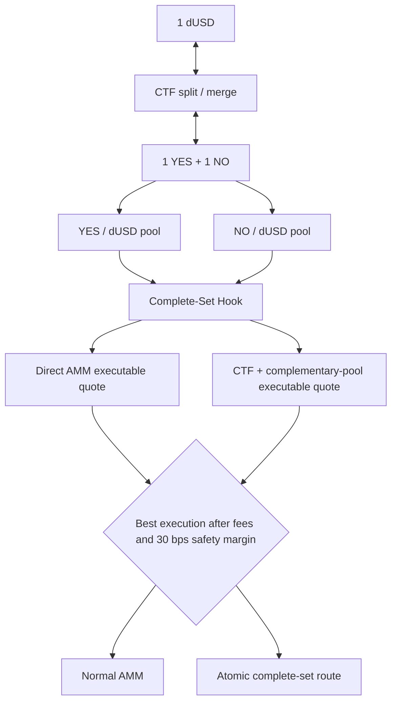

# Complete-Set Internalization Hook

> A Uniswap v4 hook that turns the binary prediction-market invariant `1 YES + 1 NO = 1 unit of collateral` into executable liquidity and a price-impact backstop.

Built for the Atrium Uniswap Hook Incubator Hookathon, Sustainable Liquidity & MEV Protection track.

## 30-second version

A binary CTF condition produces a complete set:

```text
1 dUSD ↔ 1 YES + 1 NO
```

That does **not** mean `YES = NO`, and it does not assign either outcome a fixed price. This project gives one condition two collateral-denominated Uniswap v4 pools—YES/dUSD and NO/dUSD—then compares normal AMM execution with an atomic complete-set route.

To buy YES synthetically, the hook splits dUSD, delivers YES, sells the newly created NO into the NO/dUSD pool, and charges only the net collateral cost. NO purchases work symmetrically. The hook selects this route only when its executable result beats the direct AMM by a safety margin.

## Core insight

At market prices `YES = 0.70 dUSD` and `NO = 0.30 dUSD`:

```text
1.00 dUSD -> split -> 1 YES + 1 NO
                         |
                         +-- sell NO for about 0.30 dUSD

effective YES cost = 1.00 - 0.30 = about 0.70 dUSD
```

The complementary pool supplies the synthetic price. The hook does not constrain the relative YES/NO price or assign either outcome a fixed one-dollar quote. Prices such as 80/20, 95/5, and 1/99 are legitimate.

## Architecture



One condition-level `Market` stores both `yesPoolId` and `noPoolId`. Each pool has a binding back to that market and an `isYes` flag. Registration derives both wrapped outcome addresses from the same collateral and CTF condition, validates both collateral/outcome pool keys, and prevents either pool from being rebound.

### Why two pools

We evaluated a single YES/dUSD pool with a fully synthetic NO side. That model concentrates liquidity, but it makes one outcome indirect, complicates execution UX, and pushes more routing responsibility outside a v4 pool invocation.

Two pools are the better hackathon architecture because both outcomes have direct price discovery, ordinary swaps remain understandable, and the complete-set comparison is symmetric. The cost is real liquidity fragmentation: CTF couples the economics, not the Uniswap liquidity positions. A thin complementary pool therefore makes the synthetic route unavailable or less reliable; the frontend reports that state rather than inventing a price.

## Swap decision

For an exact-input dUSD purchase of YES:

1. Quote the direct YES/dUSD AMM output for the requested input.
2. Quote selling the same number of newly split NO tokens into NO/dUSD.
3. Quote recycling those dUSD proceeds through YES/dUSD.
4. Compare total synthetic output with direct output after the 30 bps safety margin.
5. If synthetic wins, atomically split, sell NO, deliver YES, and leave only the recycled portion for the outer YES pool swap.

For exact output, the comparison is:

```text
direct AMM cost(YES, x)

versus

synthetic net cost = x dUSD - executable NO proceeds(x)
```

NO uses the same logic with YES as its complement. Outcome-to-collateral sales remain ordinary AMM swaps. The quoter uses executable amounts for the requested size, including the pool fee. It never routes from `YES spot + NO spot` alone.

## PoolManager execution safety

The complementary swap happens from `beforeSwap` while PoolManager is already unlocked. Uniswap v4 permits the nested `PoolManager.swap`; because the nested caller is the hook itself, v4 skips calling the same hook again. This avoids recursive hook execution while keeping the complementary sale atomic with the trader's swap.

The current compact on-chain quoter models the current active-liquidity range and conservatively rejects requests larger than current active liquidity. Actual execution enforces the quoted complementary proceeds as a minimum. A production version should traverse initialized ticks or use a fuller v4 simulation.

## Reserve and LP accounting

LP shares are claims on **free collateral**, not fabricated NAV for directional tokens.

During a synthetic fill:

```text
free dUSD -> CTF split -> requested outcome + complement
complement -> complementary AMM -> real dUSD
requested outcome -> trader
trader net payment -> PoolManager claim -> swept to real dUSD
```

The operation ends with zero hook-held directional inventory. Free collateral temporarily falls by the net synthetic cost, while `pendingCollateralClaims` records the equal payment owed by PoolManager. `sweepCollateralClaims` realizes that payment and restores reserve capital.

Deposits and withdrawals are blocked while claims or outcome inventory are pending. The unmatched-inventory policy is explicit: the current strategy does not assign speculative collateral value to unmatched YES or NO, and normal synthetic fills atomically dispose of the complement. A future inventory-holding strategy would require separate NAV or in-kind withdrawal accounting.

## Complete-set arbitrage and recovery

Two permissionless operations use actual cross-pool execution:

- `executeSplitArbitrage`: split `x` dUSD, sell `x` YES and `x` NO, and execute only if realized proceeds exceed basis plus the required margin.
- `executeMergeArbitrage`: buy exactly `x` YES and `x` NO, unwrap and merge them, and execute only if recovered collateral exceeds actual combined cost plus the margin.

Only realized collateral above basis is recorded as `lifetimeSurplus`. Token balance growth alone is never called profit.

## Resolution lifecycle

Once CTF reports the condition:

1. `freezeForResolution` disables synthetic routing and complete-set arbitrage.
2. Ordinary Uniswap liquidity remains separate and is not silently repriced by the hook.
3. `redeemAfterResolution` redeems any hook-held CTF inventory and credits only collateral actually received.

The winning token redeems for 1 dUSD and the losing token for zero. The hook does not apply stale pre-resolution complementary-price assumptions after freezing.

## Security properties and limitations

- Both pools must contain the configured collateral and deterministic wrapped outcomes for the same binary condition.
- Duplicate or unrelated complementary-pool registration reverts.
- Quotes use requested-size executable amounts and pool fees, not raw spot subtraction.
- Synthetic execution requires a 30 bps advantage and enforces minimum complementary proceeds.
- Insufficient reserve or complementary liquidity falls back to the direct AMM.
- Nested swaps do not recursively invoke this hook.
- Split/merge arbitrage enforces realized no-loss thresholds and credits only real collateral.
- LP withdrawal cannot occur while settlement or inventory is pending.
- Resolution freezes new internalization before redemption.

This is oracleless only in the narrow sense that CTF defines the complete-set conversion. Complementary Uniswap execution is still manipulable like any AMM. Atomic executable quotes, size limits, slippage checks, and a safety margin reduce risk; they do not eliminate sandwiching, flash-liquidity effects, or adverse movement in thin pools. The contracts are hackathon software and have not been externally audited.

Other current limitations:

- Quotes do not yet traverse multiple initialized ticks.
- The demo assumes 18-decimal collateral and wrappers.
- Cross-pool liquidity fragmentation remains a deliberate trade-off.
- The deployment uses demo CTF and wrapper contracts; Gnosis legacy-wrapper compatibility is tested separately on a fork.
- A bare Anvil node does not contain canonical Permit2. Local deployment requires the repository's v4 dependency setup/preloaded Anvil state; Unichain Sepolia already provides canonical Permit2.

## Tests

```bash
forge test --offline --no-match-contract CompleteSetInternalizationHookForkTest -vv
```

The local suite covers legitimate 80/20 probability movement; direct-AMM and synthetic routing for YES and NO; exact-input and exact-output behavior; thin and manipulated complementary pools; insufficient reserve; settlement-gated withdrawals; repeated asymmetric flow; executable split/merge arbitrage; realized collateral accounting; two-pool registration integrity; resolution freeze; and fuzzed reserve solvency.

Run the Gnosis compatibility fork separately:

```bash
forge test --match-contract CompleteSetInternalizationHookForkTest -vv
```

The images in `screenshoot/` show the superseded parity-based suite and should be replaced with a fresh corrected run.

## Reviewer evidence map

| Review question | Evidence |
| --- | --- |
| Where is best execution selected? | `CompleteSetInternalizationHook._quoteExactInput`, `_quoteExactOutput`, and `_beforeSwap` |
| Where is the complementary leg executed? | `CrossPoolExecutionLib.splitAndExecuteSynthetic` |
| How are two pools tied to one condition? | `registerMarket`, `Market`, and `PoolBinding` |
| How is reserve solvency enforced? | `freeCollateral`, `pendingCollateralClaims`, `sweepCollateralClaims`, and withdrawal guards |
| Where are executable split/merge opportunities checked? | `executeSplitArbitrage` and `executeMergeArbitrage` |
| Where are judge-facing scenarios tested? | `test/CrossPoolInternalization.t.sol` |

## Judge walkthrough

1. Start at the invariant and verify there is no YES=NO assumption.
2. Inspect atomic two-pool registration and deterministic wrapper validation.
3. Compare direct and synthetic quotes in the frontend for a small and a price-impacting trade.
4. Execute one synthetic fill, sweep its claim, and observe reserve restoration.
5. Show a thin-complement quote falling back to AMM.
6. Run the local suite and point to the 80/20, manipulation, exact-output, arbitrage, withdrawal, and fuzz tests.

## Deployment

The corrected two-pool architecture is live on Unichain Sepolia (chain ID 1301).

| Component | Live deployment |
| --- | --- |
| Hook | [`0xCeA4...c088`](https://sepolia.uniscan.xyz/address/0xCeA4463D4dE99aC8440453F3B76A9595Ecb3c088) |
| Quoter | [`0x0a5b...9F22`](https://sepolia.uniscan.xyz/address/0x0a5b09661Ae9b09ABfd6BB4372Cf5487a1f69F22) |
| dUSD collateral | [`0x3174...d70b`](https://sepolia.uniscan.xyz/address/0x3174b22C3729DD9Bf31AF15BCc3208221C69d70b) |
| Wrapped YES | [`0x663D...2095`](https://sepolia.uniscan.xyz/address/0x663D1cFC580Ed43266225a3F7CA005d1B3622095) |
| Wrapped NO | [`0x00aF...7C0d`](https://sepolia.uniscan.xyz/address/0x00aFD13D60333F2c2924aA4B9C809BDB01527C0d) |
| Market ID | `0x997a0d2a758054a2553fad38964c180c01c16839bf90b3b1673fd78c096322ff` |
| YES/dUSD PoolId | `0x45ee37d48d576255bd642742ceb1c54fe1ec6812ff1b6363526e07dd40fa9382` |
| NO/dUSD PoolId | `0xc505f3ea73822e36ab7e3152774ece4511922ef7fb6bc872d6712a65d2d17102` |

On-chain verification after deployment showed both pools registered to the same condition, 20 active liquidity units in each pool, 1,000 dUSD of free hook reserve, 1,000 LP shares, zero pending claims, and zero directional inventory. All 44 broadcast transactions succeeded.

The earlier hook at `0xc88B0aC546a99B586199dDBeE30D801Ee1d80088` is **obsolete**. It is immutable and implements the superseded YES/NO architecture.

To reproduce the deployment:

```bash
export UNICHAIN_SEPOLIA_RPC_URL=https://sepolia.unichain.org
export DEPLOYER_ADDRESS=<funded-address>

forge script \
  script/00_DeployCompleteSetInternalizationHook.s.sol:DeployCompleteSetInternalizationHookScript \
  --rpc-url "$UNICHAIN_SEPOLIA_RPC_URL" \
  --account hookathon-deployer \
  --sender "$DEPLOYER_ADDRESS" \
  --broadcast \
  --slow \
  --skip-simulation \
  -vv
```

The checked-in `frontend/public/deployment.json` contains this verified deployment, including `marketId`, `yesPoolKey`, and `noPoolKey`. Regenerate ABIs after interface changes:

```bash
node scripts/sync-frontend-abis.mjs
```

## Frontend

```bash
cd frontend
npm install
npm run dev
```

Select YES/dUSD or NO/dUSD. The Swap card compares the direct AMM with the executable complete-set route, including complementary-sale proceeds. Liquidity shows reserve collateral and active Uniswap liquidity separately. Settlement converts PoolManager claims from synthetic fills into real reserve collateral.
